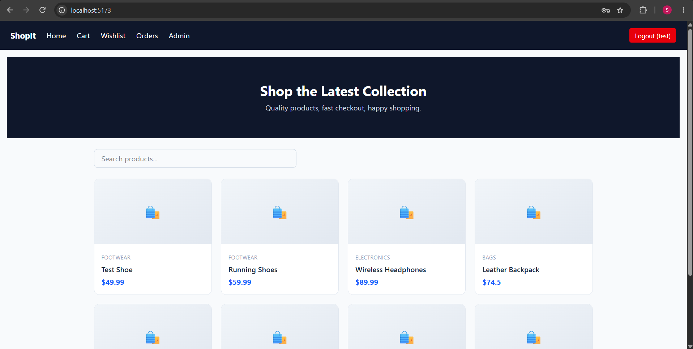
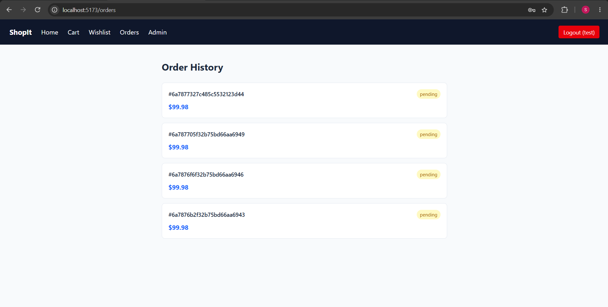
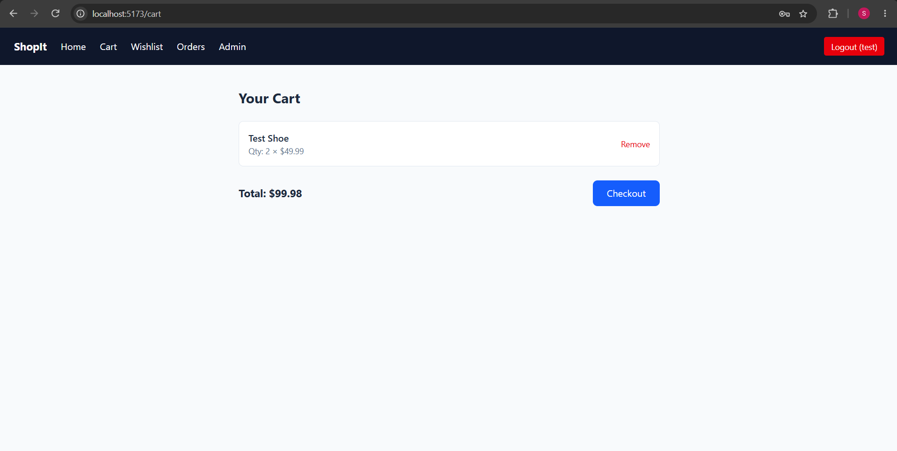

# ShopIt -- MERN E-commerce App

Full-stack e-commerce platform with authentication, cart, wishlist, Stripe payments, and an admin dashboard with sales analytics.

## Tech Stack
- **Frontend:** React (Vite), Tailwind CSS, React Router
- **Backend:** Node.js, Express, MongoDB (Mongoose)
- **Auth:** JWT, bcrypt
- **Payments:** Stripe Checkout

## Features
- User signup/login with JWT auth
- Product listing, search & category filter
- Cart & wishlist management
- Stripe checkout integration
- Order history
- Admin dashboard: product CRUD, sales analytics

## Setup

### Backend
\`\`\`bash
cd server
npm install
# create .env with MONGO_URI, JWT_SECRET, STRIPE_SECRET_KEY, CLIENT_URL
npm run dev
\`\`\`

### Frontend
\`\`\`bash
cd client
npm install
npm run dev
\`\`\`

## Screenshots

### Home

### Admin Dashboard

### Cart

