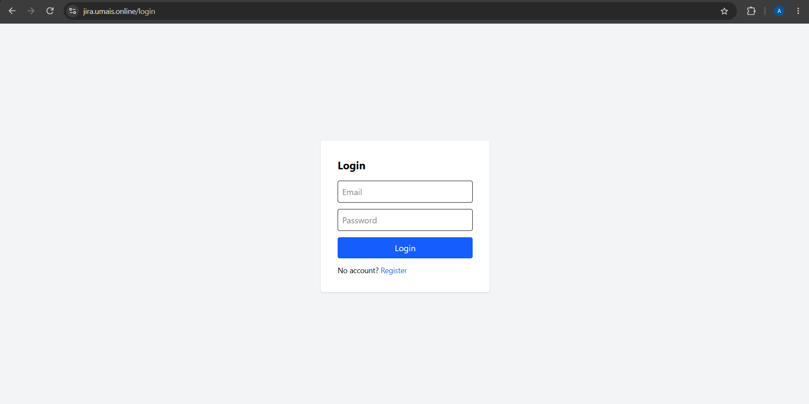
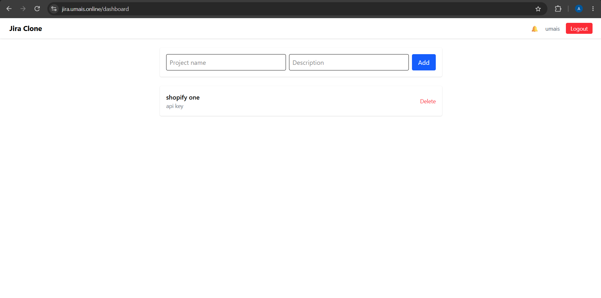
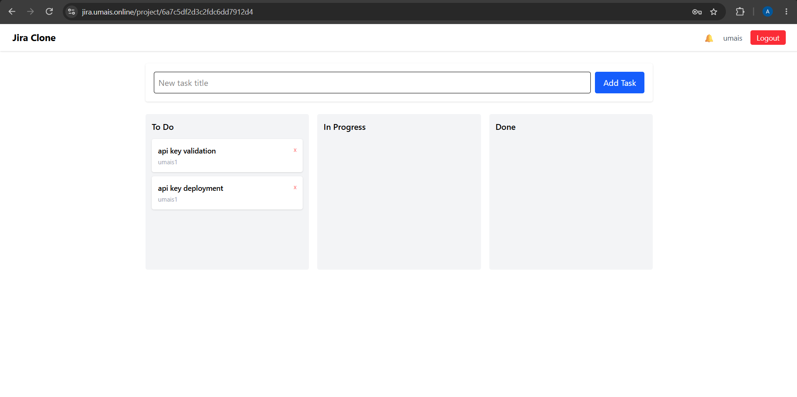
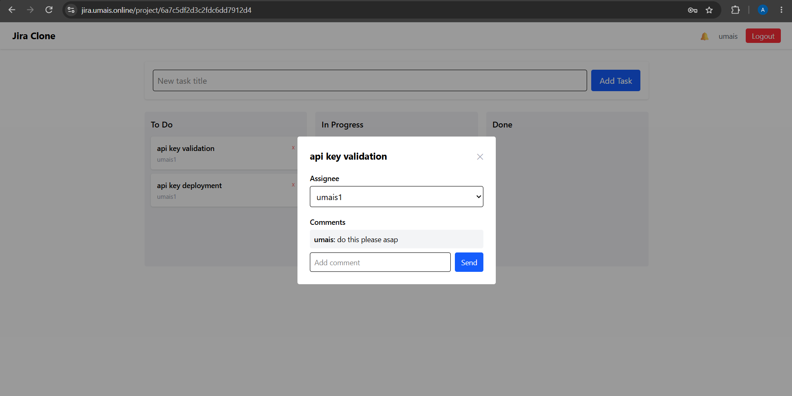

# Jira Clone — Project Management System

A full-stack project management tool inspired by Jira, built to demonstrate real-time collaboration features, complex state management, and a complete MERN stack workflow.

---

🔗 **Live Demo:** https://jira.umais.online

## Features

- **Authentication** — JWT-based register/login, protected routes
- **Projects** — create projects, add/manage team members
- **Tasks** — create, update, delete tasks within a project
- **Kanban Board** — drag & drop tasks across To Do / In Progress / Done columns
- **Task Assignment** — assign tasks to team members
- **Comments** — real-time comments on tasks
- **Activity Log** — tracks task creation and updates per project
- **Notifications** — real-time in-app notifications when assigned to a task
- **Live Updates** — Socket.io powers real-time sync across all connected clients (no refresh needed)

---

## Tech Stack

**Frontend**
- React (Vite)
- Tailwind CSS
- Zustand — state management
- React Router
- Axios
- Socket.io-client
- @hello-pangea/dnd — drag & drop

**Backend**
- Node.js + Express
- MongoDB + Mongoose
- Socket.io — real-time events
- JWT — authentication
- bcryptjs — password hashing

---

## Project Structure

```
jira-clone/
  backend/
    src/
      config/       # DB connection
      models/       # User, Project, Task, Activity, Notification
      controllers/   # Route logic
      routes/        # API endpoints
      middleware/    # JWT auth middleware
      utils/         # Activity/notification helpers
      server.js
  frontend/
    src/
      api/           # Axios API calls
      components/    # Navbar, TaskModal, ProtectedRoute
      pages/         # Login, Register, Dashboard, ProjectBoard
      store/         # Zustand auth store
      socket.js
      App.jsx
```

---

## Getting Started

### Backend
```bash
cd backend
npm install
# create .env with MONGO_URI, JWT_SECRET, PORT, CLIENT_URL
npm run dev
```

### Frontend
```bash
cd frontend
npm install
npm run dev
```

---

## Screenshots

_Add screenshots here: Login page, Dashboard, Kanban board, Task modal with comments_

---

## What This Project Demonstrates

- Real-world business application architecture (not a to-do app)
- Real-time features using WebSockets (Socket.io)
- Complex, interdependent state across multiple entities (projects → tasks → comments/activity/notifications)
- Clean REST API design with proper auth middleware
- Team collaboration UX patterns (drag & drop boards, assignment, live notifications)


## Screenshots

### Login


### Dashboard


### Kanban Board


### Task Detail
